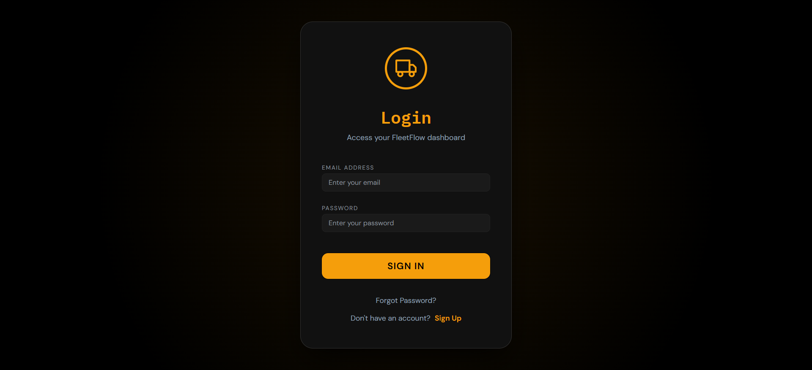
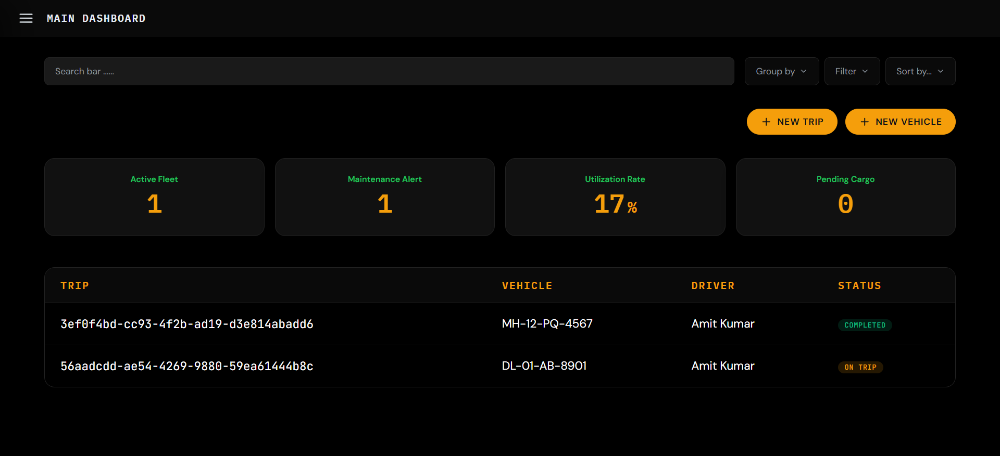
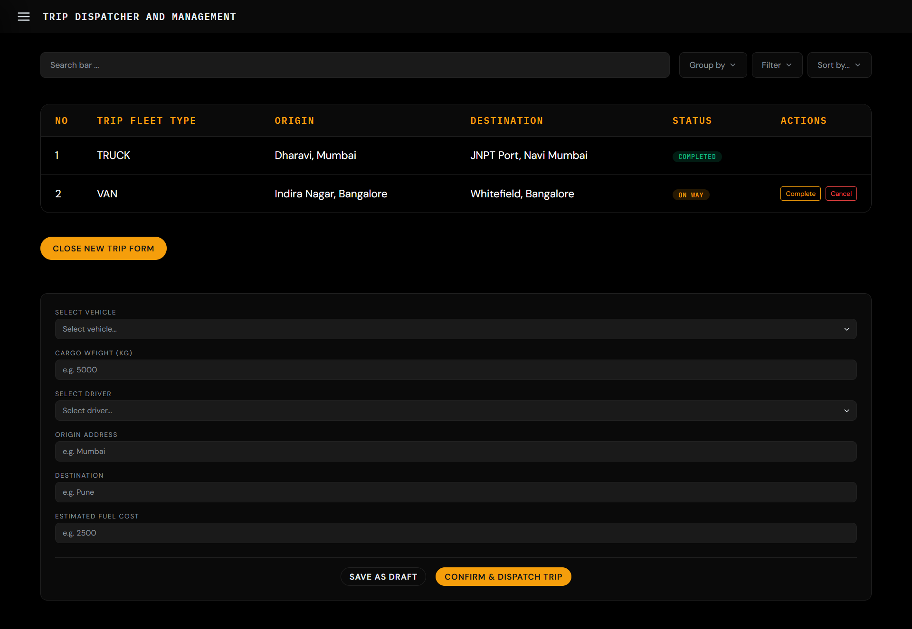
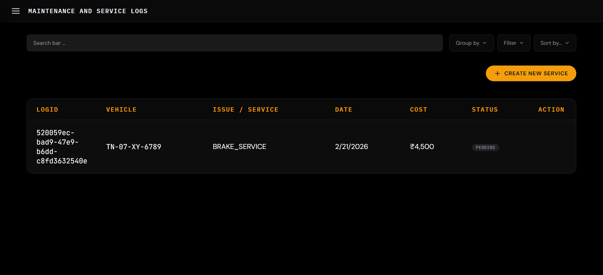
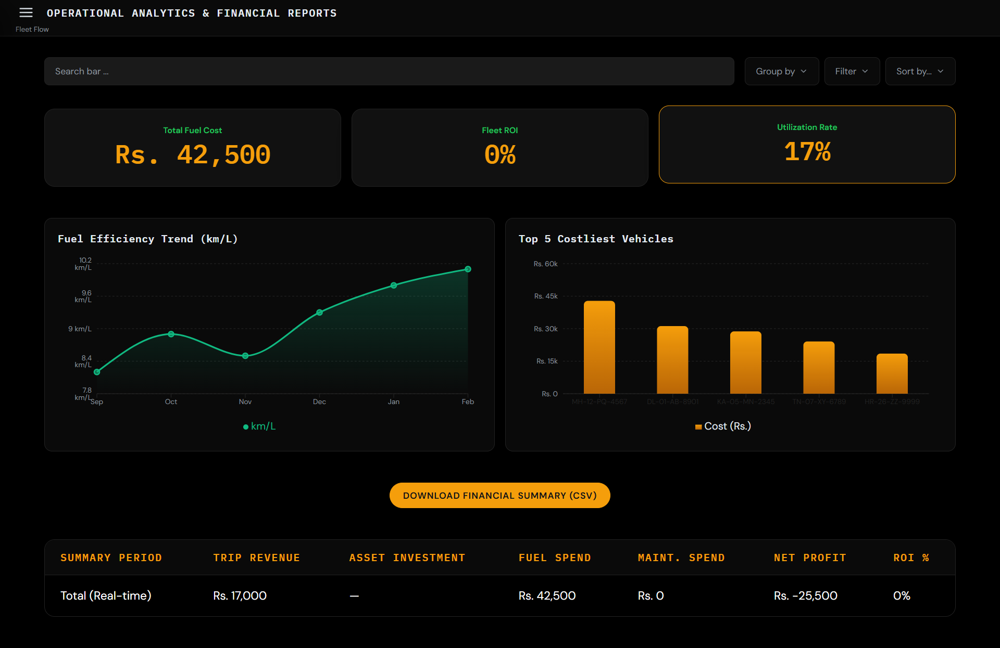

# FeelFleet – Fleet & Logistics Management

A full-stack fleet management system for vehicles, trips, drivers, maintenance, and analytics with role-based access (Manager, Dispatcher, Safety Officer, Financial Analyst).

# Tech Stack

| Layer    | Technologies                                                                          |
| -------- | ------------------------------------------------------------------------------------- |
| Frontend | React 18, TypeScript, Vite 7, React Router 6, Recharts, Zustand, React Hook Form, Zod |
| Backend  | Node.js, Express 4, TypeScript, TSX (dev)                                             |
| Database | PostgreSQL 15, Prisma 6 (ORM + migrations)                                            |
| Auth     | JWT (httpOnly cookies), bcrypt, role-based access control (RBAC)                      |
| DevOps   | Docker & Docker Compose (Postgres, pgAdmin, backend, frontend)                        |
| Tooling  | ESLint, Prettier, Pino (logging), Helmet, express-rate-limit                          |

# Repository Structure

| Directory                  | Description                                                                        |
| -------------------------- | ---------------------------------------------------------------------------------- |
| FeelFleet-Odoo/            | Root project directory                                                             |
| backend/                   | Express API server                                                                 |
| backend/src/               | Source code                                                                        |
| backend/src/config/        | Environment, database, CORS, logger configs                                        |
| backend/src/middleware/    | Auth, RBAC, validation, rate-limit, error handling                                 |
| backend/src/modules/       | Feature modules (auth, vehicles, drivers, trips, maintenance, expenses, analytics) |
| backend/src/events/        | EventEmitter for trip/vehicle events                                               |
| backend/src/jobs/          | Scheduler (license expiry checker)                                                 |
| backend/src/utils/         | API response, PDF generation, helpers                                              |
| backend/src/types/         | TypeScript enums, global types                                                     |
| backend/package.json       | Backend dependencies                                                               |
| frontend/                  | React Single Page Application                                                      |
| frontend/src/api/          | API clients for all modules                                                        |
| frontend/src/assets/icons/ | UI icons (Dashboard, Truck, Route, etc.)                                           |
| frontend/src/components/   | Reusable components (dashboard, layout, UI)                                        |
| frontend/src/constants/    | Roles, routes constants                                                            |
| frontend/src/pages/        | All application pages                                                              |
| frontend/package.json      | Frontend dependencies                                                              |
| database/                  | Database schema and seeds                                                          |
| database/prisma/           | Prisma schema and migrations                                                       |
| database/seeds/            | Database seed data                                                                 |
| docs/                      | API.md, SETUP.md, RBAC.md, WORKFLOW.md                                             |
| docker-compose.yml         | Docker services (Postgres, pgAdmin, backend, frontend)                             |
| .gitignore                 | Git ignore rules                                                                   |
| README.md                  | Project documentation                                                              |

# Quick Start
Docker (Recommended)
Start all services
docker-compose up

Frontend: http://localhost:5173
Backend API: http://localhost:4000
pgAdmin: http://localhost:5050 (admin@fleetflow.com / admin)

Local Setup (Without Docker)
Prerequisites: Node 18+, PostgreSQL 15, npm.

# Database
Create a DB (e.g. feelfleet).
Set DATABASE_URL in backend/.env (see backend/.env.example).

# Backend
cd backend
npm install
npm run db:generate
npm run db:migrate
npm run db:seed
npm run dev
API: http://localhost:4000

# Frontend
cd frontend
npm install
cp .env.example .env  # set VITE_API_URL=http://localhost:4000
npm run dev
App: http://localhost:5173

Seed Logins:
admin@feelfleet.in / password123 (Manager)
prakash@feelfleet.in / password123 (Dispatcher)​

## Screenshots

| Screen                                                                                              | Description                                 |
| --------------------------------------------------------------------------------------------------- | ------------------------------------------- |
|                          | User login interface                        |
|                        | User registration form                      |
|          | Completed signup form                       |
|                      | Application navigation sidebar              |
|                  | Main dashboard – KPIs, filters, trips table |
|   | Vehicle list and registration               |
|       | Vehicle log entry button                    |
|                          | Trip management interface                   |
|                      | Maintenance service overview                |
|       | Service log entry button                    |
|      | Combined expense and fuel tracking          |
|           | Fuel logging interface                      |
|  | Drivers and safety management               |
|                  | Analytics dashboard and KPIs                |

Short description: login, dashboard, vehicle, trip, maintenance, and analytics.

Explnation video link: https://files.catbox.moe/nddf0a.mp4

<video src="docs/demo.mp4" controls width="640"></videos

# Features

Auth & RBAC: Login/register, JWT in httpOnly cookie, roles: Manager, Dispatcher, Safety Officer, Financial Analyst.
Dashboard: Active fleet, maintenance alerts, utilization rate, pending cargo, trips table with filters.
Vehicle Registry: Add/edit, retire (out of service), filter by type/region.
Trip Dispatcher: Create trip (capacity + license checks), dispatch → complete/cancel, vehicle/driver status.
Maintenance: Service logs, vehicle → In Shop, complete → Available.
Expenses & Fuel: Log fuel, vehicle total cost (fuel + maintenance).
Analytics: KPIs, fuel efficiency, financial summary, costly vehicles.
Driver Profiles: License expiry, duty status, completion rate.

# API Overview
GET/POST /api/auth/* – login, register, logout, me
GET/POST/PATCH /api/vehicles/* – list, create, update, retire, available
GET/POST/PATCH /api/drivers/* – list, create, update, duty status, available
GET/POST/PATCH /api/trips/* – list, create, update status
GET/POST/PATCH /api/maintenance/* – logs, create, complete
GET/POST /api/expenses/* – list, create, fuel, vehicle total
GET /api/analytics/* – kpis, fuel-efficiency, financial-summary, costly-vehicles

# Details: see docs/API.md.​

# License
MIT License.
​
